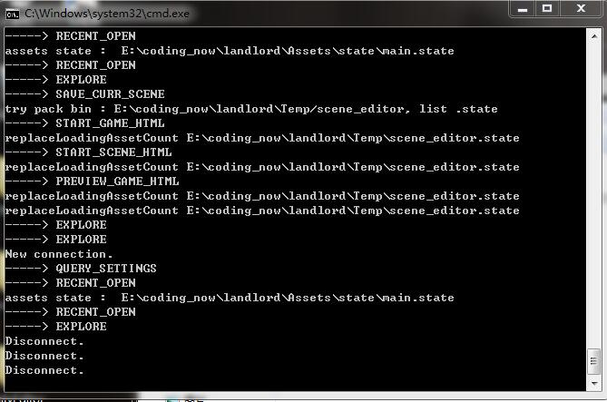
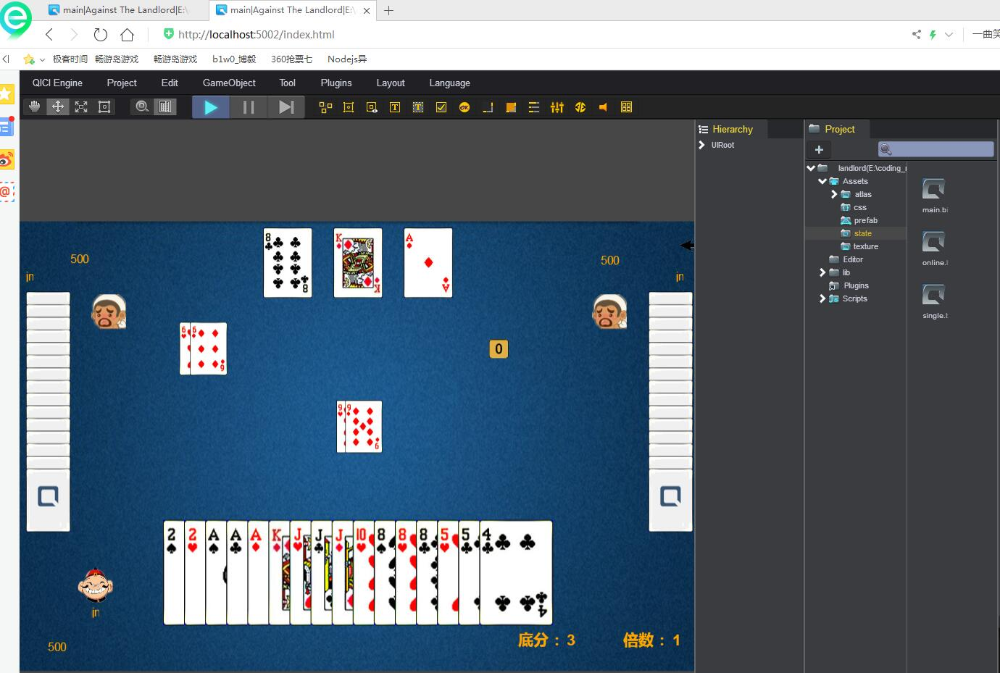

# qiciengine + node.js 斗地主

## 1）客户端 支持联网和ai
*  客户端是用qiciengine导入客户端工程然后打开，而不是cocos creator，qiciengine是一款类似于unity的开源编辑器，很强大。

## 2）服务器
*  服务器是node.js 6.11.1，越来越喜欢这个玩意了,别的node版本报错

## 3）环境搭建

### 1.mysql数据库启动

```
1.查看当前数据库
mysql> SHOW DATABASES;
+--------------------+
| Database           |
+--------------------+
| information_schema |
| mysql              |
| nodejs             |
| performance_schema |
| sys                |
+--------------------+
5 rows in set (0.11 sec)

2.创建数据库
mysql> CREATE DATABASE landlord;
Query OK, 1 row affected (0.00 sec)

3.使用数据库
mysql> USE landlord;
Database changed

4.导入数据库
mysql> SOURCE /Users/ariesh/Documents/work/ddz-qiciengine-node/ddz-server/sql/player_score.sql;

5.展示数据库中的表
mysql> SHOW TABLES;
+--------------------+
| Tables_in_landlord |
+--------------------+
| player_score       |
+--------------------+
1 row in set (0.00 sec)

6.查询当前数据库表的内容
mysql> SELECT * FROM player_score;
Empty set (0.01 sec)
```

### 2.服务器启动

```
➜  ddz-server git:(master) ✗ sh start-server.sh
连接 mysql 数据库中...
斗地主服务开启，port = 8081
```

### 3.qiciengine启动客户端

*  windows
  


*  mac启动(运行脚本，自动启动)

```
➜  qiciengine-1.0.2 git:(master) ✗ sh start-mac.sh
(node:15656) fs: re-evaluating native module sources is not supported. If you are using the graceful-fs module, please update it to a more recent version.
Port = 5002
New connection.
-----> QUERY_SETTINGS
-----> RECENT_OPEN
-----> CHECK_FOR_UPDATES
-----> RECENT_OPEN
```

## 4)运行效果

